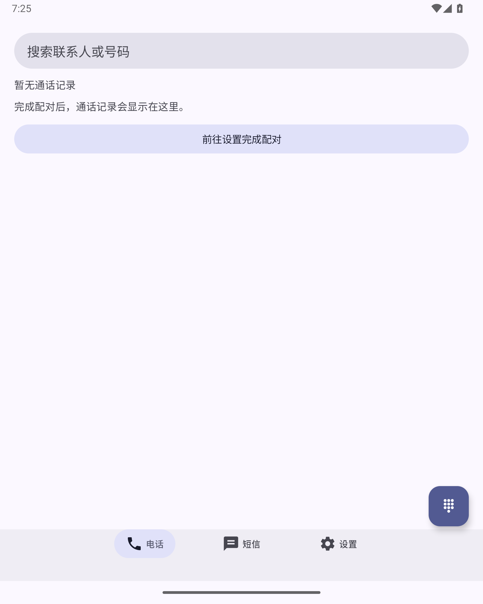
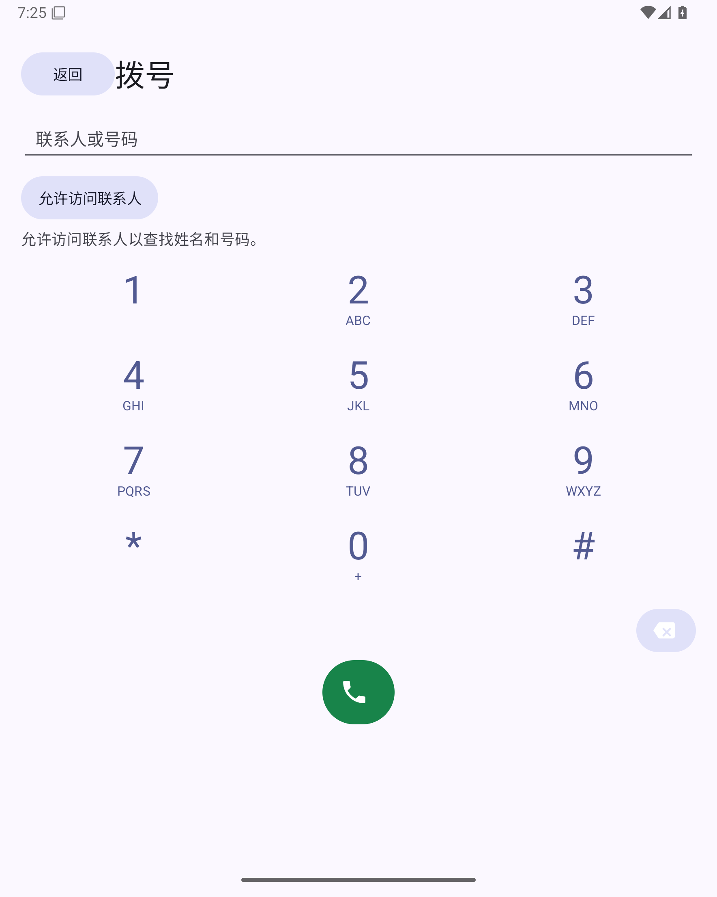
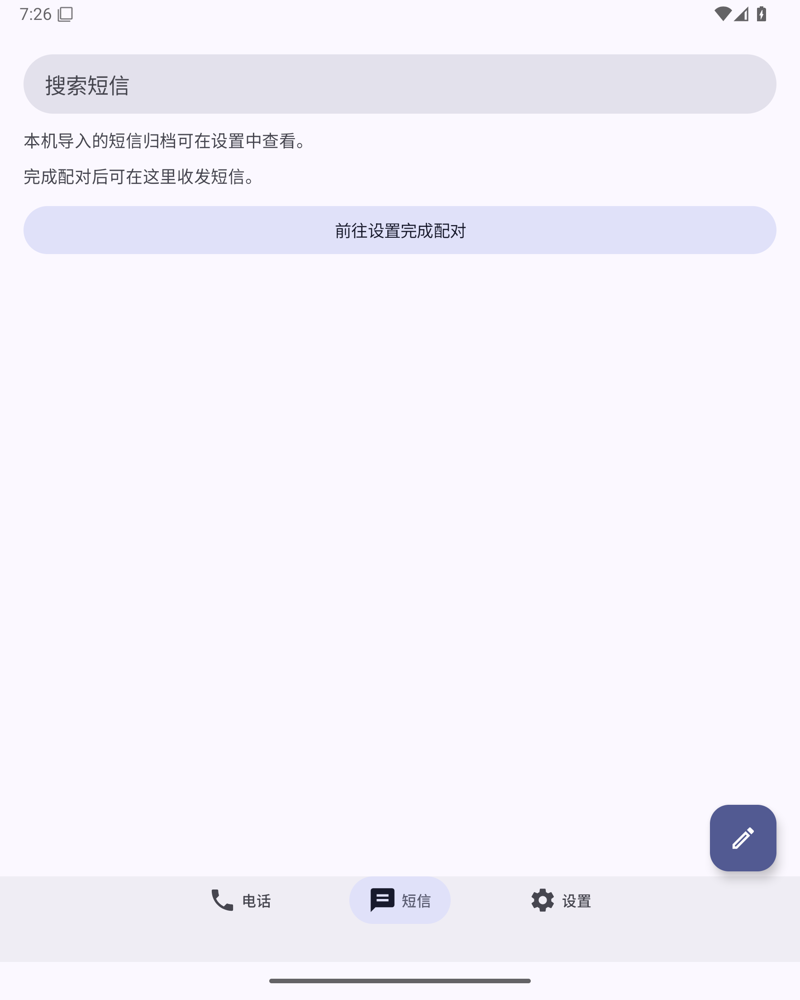
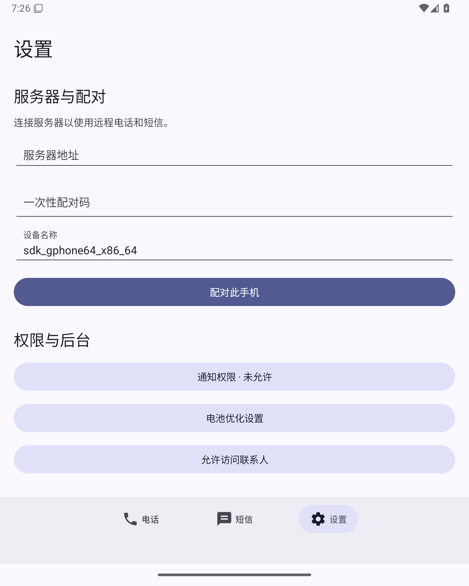
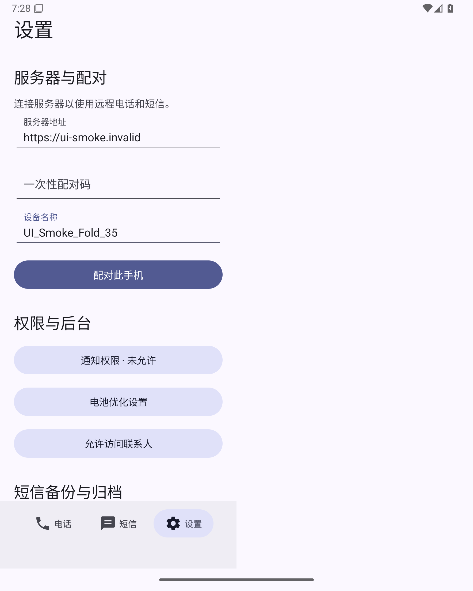
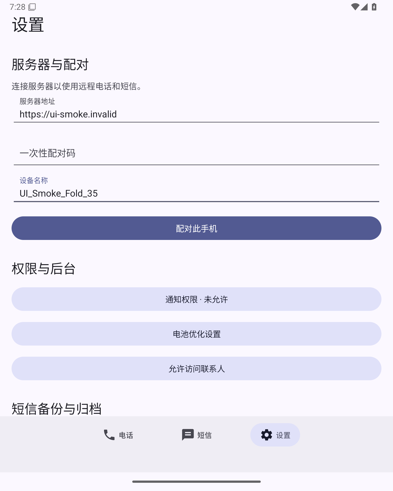
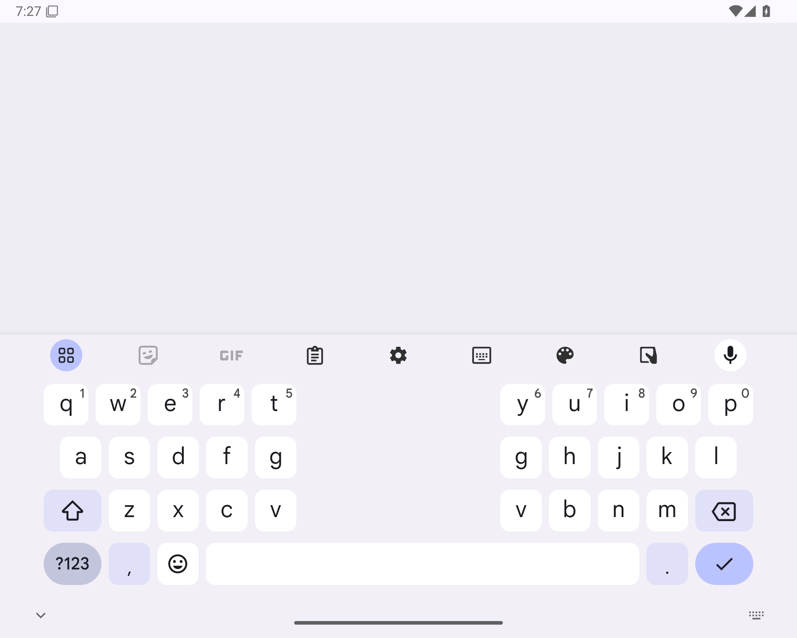
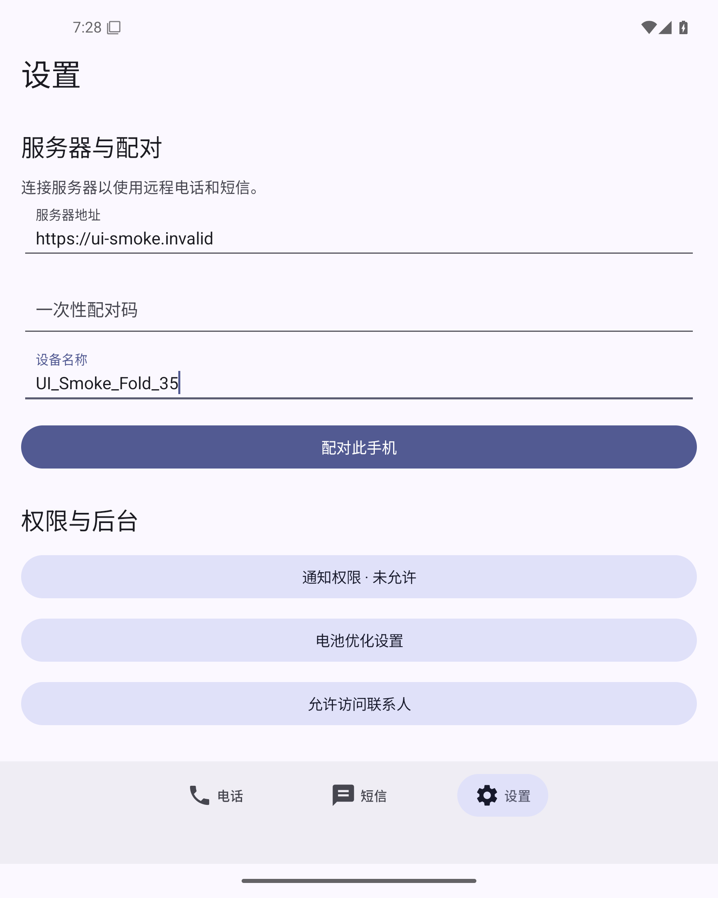

# 主机 UI 重构：截图与验证

主机界面使用 Material 3，底栏固定为 **电话 / 短信 / 设置**。电话页提供历史和本机联系人搜索，拨号页使用独立键盘；短信页提供按 SIM 与号码分组的会话和新建短信入口；设置包含服务器、配对、权限和短信备份。配对后的同步与补收自动运行。

## 验证状态

- 完整本地构建、102 项测试通过，lint 无错误；图标对比度调整后另行重跑 13 项界面测试、构建与 lint，全部通过。详情见 [local-checks.json](local-checks.json)。
- 下方原始截图来自 [API 35 折叠屏 KVM 运行](https://github.com/KiriKira/gsm2sip-client-android/actions/runs/37362657579)，测试提交为 `bd7d99a6985f4ea0fec9822f2a2246609b771948`。其 30 项检查通过，涵盖三个底栏、拨号键盘、旋转、键盘恢复、合拢/展开及打孔安全区。
- 该运行整体失败：脚本把底栏后方的备份入口误认为可点击，后续备份检查被阻断。已按原始 XML 修正可点击视口与滚动手势。完整结果保存在 [initial-ui-results.json](initial-ui-results.json)。
- **配对后的会话、SIM 选择和四种通话状态的运行截图仍待验证。** 2026-10-05 19:43 UTC，[GitHub 官方状态页](https://www.githubstatus.com/)报告 Actions `degraded_performance`，新任务尚未获分配 runner。

成功的 main KVM 工作流会自动保存完整原始截图，并以新报告替换本页。只有界面检查全部通过、被测源码仍与当前 main 匹配时才会发布；失败运行不会标记为通过。此处已有的原始图片和验证记录会保留。

## 三个底栏与独立拨号页

| 电话首页（未配对） | 独立拨号页 |
| --- | --- |
|  |  |

| 短信首页（未配对） | 设置与配对 |
| --- | --- |
|  |  |

图片来自图标对比度修正前的构建；代码已增加删除号码和通话控制图标的对比度。

## 折叠、旋转、键盘与打孔

| 合拢 | 展开 |
| --- | --- |
|  |  |

| 横屏与键盘恢复 | 打孔安全区 |
| --- | --- |
|  |  |

截图为直接从工作流取回的 PNG，没有修改图片；文件校验和、源提交及 artifact 标识见 [initial-evidence.json](initial-evidence.json)。模拟器为 API 35 的 7.6 英寸折叠屏配置。Z Fold8 真机、真实 SIM 来电与双向语音仍需设备验收；合成通话截图只验证界面状态。
